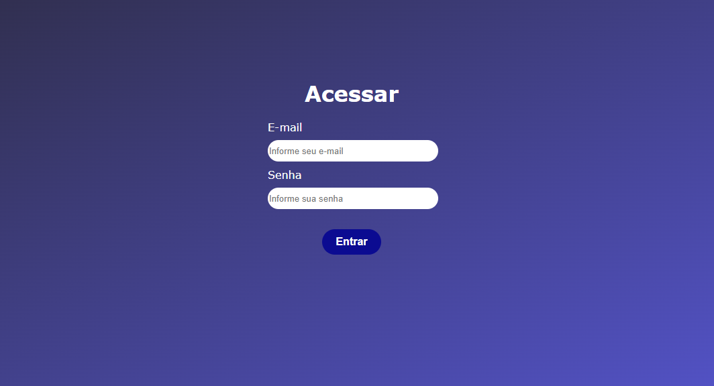

# projeto-login-autoral

### Descrição

 Projeto criado na aula da disciplina de programação Front-End, na Unicesumar, campus de Londrina. O professor [Leonardo Rocha](https://github.com/leonardossrocha) introduziu os conceitos de framework, apresentando o Bootstrap e alguns exemplos disponíveis nesse framework, e fit, realizando o passo-a-passo de configuração do ambiente de desenvolvimento.

### Introdução

 O código cria um sistema de tela de login e perguntas frequentes, feito com base em um exemplo do Bootstrap, adaptando as devidas informações relevantes. O projeto tem pretensão de adaptação e evolução gradual, sendo feito em ambiente acadêmico.

### Ferramentas Utilizazas

- HTML5
- CSS3
- Git

### Autor
[Matheus Carvalho](https://github.com/MatheusCarvalhoo7)